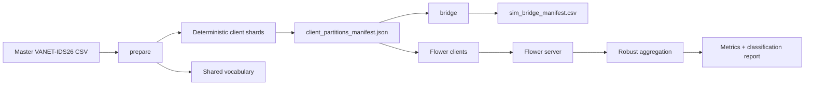

# VANET-IDS26 Flower Federated Learning Pipeline

This repository contains a reproducible Flower-based federated learning pipeline for the VANET-IDS26 intrusion-detection dataset. The pipeline uses a structured-message transformer, deterministic non-IID client partitioning, robust aggregation, and GPU execution support.

## What This Repository Does

- Uses the VANET-IDS26 full master CSV as the source corpus.
- Builds reproducible non-IID federated client shards directly from the master CSV.
- Builds the shared vocabulary used by the structured-message Transformer.
- Creates an OMNeT++ / Veins bridge manifest for simulation-to-client mapping.
- Runs a Flower server with robust aggregation.
- Runs multiple Flower clients, including optional malicious clients for robustness testing.
- Evaluates with client-local validation streams derived inside each shard.

## Current Dataset Layout

The active dataset source is:

- `data/vanet_ids26_master.csv`

The current local master CSV contains `117,288,201` rows. The latest Flower workflow does not rebuild separate train, validation, or test CSV files. Instead, `prepare` streams the master CSV and writes federated client shards under `data/client_shards/`. During training, each client shard is split internally into local training and validation streams: rows satisfying `(row_index + seed) % 5 == 0` are used for validation, and the remaining rows are used for local training.

Generated runtime artifacts include:

- `data/client_shards/`
- `data/manifests/client_partitions_manifest.json`
- `data/manifests/temporal_flbert_vocab.json`
- `data/manifests/sim_bridge_manifest.csv`
- `models/final_global_model.pt`

Large CSV files, client shards, logs, generated manifests, and model checkpoints are intentionally kept out of normal source-control workflows.

## Attack Classes

The dataset is balanced across `27` labels: one benign class and `26` attack classes. The descriptions below are short operational summaries derived from the manifest/codebook naming, so they are meant to help readers interpret the classes rather than replace the original simulation definitions.

| Label | Class name | Short description |
| --- | --- | --- |
| `0` | `benign` | Normal, unmodified VANET safety message. |
| `1` | `constant_position` | Claimed position remains fixed across time instead of changing naturally. |
| `2` | `position_offset` | Claimed position is shifted away from the true location by a systematic offset. |
| `3` | `random_position` | Claimed position is randomized rather than consistent with the real vehicle state. |
| `4` | `speed_manipulation` | Claimed speed is altered to misrepresent the real velocity. |
| `5` | `acceleration_manipulation` | Claimed acceleration is altered to misrepresent the real motion dynamics. |
| `6` | `heading_manipulation` | Claimed heading or orientation is falsified. |
| `7` | `lane_spoofing` | Claimed lane identifier is falsified to place the sender in the wrong lane. |
| `8` | `impossible_kinematics` | Reported state violates physical consistency constraints. |
| `9` | `eventual_stop` | The message sequence indicates an abnormal or forced stop condition. |
| `10` | `false_brake_event` | A braking event is injected or exaggerated to look like an emergency stop. |
| `11` | `false_emergency_vehicle` | A vehicle is falsely presented as an emergency vehicle. |
| `12` | `false_hazard_event` | A road hazard warning is fabricated or exaggerated. |
| `13` | `replay` | A previously captured valid message is resent. |
| `14` | `delayed_message` | A legitimate message is delivered late enough to reduce freshness. |
| `15` | `timestamp_shift` | The timestamp is manipulated to make the message appear older or newer. |
| `16` | `stale_message_replay` | An outdated message is replayed after it should no longer be trusted. |
| `17` | `sybil` | One attacker creates multiple apparent identities. |
| `18` | `impersonation` | A sender forges or steals another identity. |
| `19` | `pseudonym_abuse` | Pseudonyms are abused to evade tracking or accountability. |
| `20` | `flooding_ddos` | The channel or receiver is overloaded with excessive traffic. |
| `21` | `beacon_rate_abuse` | Beacon messages are sent too frequently to create abnormal load. |
| `22` | `gnss_spoofing` | GNSS-derived location information is falsified or spoofed. |
| `23` | `map_location_spoofing` | Map or location context is manipulated to show the wrong position. |
| `24` | `ghost_vehicle` | A non-existent vehicle is fabricated in the message stream. |
| `25` | `false_object_injection` | A fake road object is injected into the scene description. |
| `26` | `object_position_shift` | The position of a reported object is shifted away from its true location. |

## Observed Dataset Size

Latest active source file:

- `data/vanet_ids26_master.csv` - `117,288,201` rows

The active Flower pipeline uses this master file to prepare client shards. Separate train/validation/test CSV files are not part of the cleaned latest-run workflow.

## Environment

Tested on:

- Linux host: `natogpu`
- CUDA GPU: `NVIDIA L40S`
- GPU selection used in commands: `CUDA_VISIBLE_DEVICES=1`
- Python: system `python3`
- Training framework: Flower
- ML backend: PyTorch

## System Architecture

### High-Level Flow



### Pipeline Components

#### 1. Dataset Layer

- The master dataset is the authoritative input.
- `prepare` streams the master dataset and creates non-IID client shards.
- Reproducible manifests capture the source path, row count, shard paths, label distributions, vocabulary path, and model sequence length.

#### 2. Federated Partition Layer

- `prepare` creates deterministic non-IID shards using a Dirichlet partition.
- The shards are stored under `data/client_shards/`.
- A partition manifest records:
  - client IDs
  - shard paths
  - row counts
  - label distributions
  - vocabulary path
  - max sequence length

#### 3. Bridge Layer

- `bridge` creates `sim_bridge_manifest.csv`.
- This maps client IDs to OMNeT++ / Veins-style run metadata.

#### 3a. Closed-Loop OMNeT++ / Veins Integration Layer

- The Flower server saves the final global IDS model to `models/final_global_model.pt`.
- `scripts/closed_loop_ids_server.py` serves the trained model over HTTP.
- Veins/OMNeT++ modules can call `POST /predict` for each vehicle message or SDN event.
- The IDS server returns a predicted attack class, confidence score, and mitigation action.
- The simulation can apply SDN actions such as message dropping, sender monitoring, or sender isolation.

Integration assets are under:

- `omnetpp_veins_integration/src/ClosedLoopIdsClient.h`
- `omnetpp_veins_integration/src/ClosedLoopIdsClient.cc`
- `omnetpp_veins_integration/examples/VeinsAppHook.cc`
- `omnetpp_veins_integration/protocol/predict_request_example.json`

#### 4. Model Layer

- The model is a Temporal FL-BERT style transformer:
  - token embeddings
  - positional embeddings
  - learned `[CLS]` token
  - stacked transformer encoder blocks
  - classification head

#### 5. Federated Learning Layer

- The Flower server coordinates rounds.
- Robust aggregation options:
  - `fedmedian`
  - `fedtrimmedavg`
- Clients can be marked malicious for robustness experiments:
  - `none`
  - `sign_flip`
  - `noise`

## Latest Configuration

### Data Preparation

- Source: `data/vanet_ids26_master.csv`
- Clients: `4`
- Label column: `multiclass_label`
- Number of labels: `27`
- Dirichlet alpha: `1.0`
- Vocabulary size: `8000`
- Max sequence length: `64`
- Seed: `42`

### Model

- `d_model=128`
- `nhead=8`
- `num_layers=4`
- `dropout=0.15`

### Federated Server

- Address: `127.0.0.1:8080`
- Rounds: `10`
- Robust aggregation: `fedtrimmedavg`
- Trimmed beta: `0.1`
- Minimum fit clients: `4`
- Minimum evaluate clients: `4`
- Minimum available clients: `4`
- Local epochs: `1`
- Server evaluation batch size: `64`
- Server evaluation max batches: `1024`

### Client Runtime

- Batch size: `64`
- Local epochs: `1`
- Training cap: `10000` batches per client per round
- Learning rate: `1e-4`
- Class weighting: `global`
- Class weight power: `1.0`
- Chunk-level training shuffle: enabled
- CUDA device: `CUDA_VISIBLE_DEVICES=1`
- Malicious client testing: optional

## Installation / Setup

If dependencies are already installed, you can skip this section. Otherwise:

```bash
cd /opt/sahsan03/VANET-IDS26
python3 -m venv .venv
source .venv/bin/activate
pip install --upgrade pip
pip install -r requirements.txt
```

If the repository does not contain a `requirements.txt`, install the needed runtime packages manually:

```bash
pip install flwr torch pandas numpy scikit-learn
```

## Verification

The cleaned Flower pipeline exposes the active commands only:

```bash
cd /opt/sahsan03/VANET-IDS26
python3 scripts/flower_vanet_pipeline.py --help
```

Expected subcommands:

- `prepare`
- `bridge`
- `baridge`
- `server`
- `client`

A lightweight smoke test can be run by copying the script to a temporary folder with a tiny `data/vanet_ids26_master.csv`, then running `prepare --limit-rows` and `bridge`. This avoids overwriting the production client shards and vocabulary.

## End-to-End Operational Process

### 1. Prepare the federated shards

This step builds the shared vocabulary and deterministic non-IID client shards from the master corpus.

```bash
cd /opt/sahsan03/VANET-IDS26
CUDA_VISIBLE_DEVICES=1 python3 scripts/flower_vanet_pipeline.py prepare \
  --source master \
  --clients 4 \
  --label-column multiclass_label \
  --num-labels 27 \
  --seed 42 \
  --dirichlet-alpha 1.0 \
  --vocab-size 8000 \
  --max-seq-len 64
```

Output:

- `data/client_shards/client_000_multiclass_label.csv`
- `data/client_shards/client_001_multiclass_label.csv`
- `data/client_shards/client_002_multiclass_label.csv`
- `data/client_shards/client_003_multiclass_label.csv`
- `data/manifests/client_partitions_manifest.json`
- `data/manifests/temporal_flbert_vocab.json`

### 2. Create the bridge manifest

```bash
cd /opt/sahsan03/VANET-IDS26
python3 scripts/flower_vanet_pipeline.py bridge
```

Output:

- `data/manifests/sim_bridge_manifest.csv`

### 3. Start the Flower server

```bash
cd /opt/sahsan03/VANET-IDS26
CUDA_VISIBLE_DEVICES=1 python3 scripts/flower_vanet_pipeline.py server \
  --address 127.0.0.1:8080 \
  --rounds 10 \
  --robust-aggregation fedtrimmedavg \
  --trimmed-beta 0.1 \
  --min-fit-clients 4 \
  --min-evaluate-clients 4 \
  --min-available-clients 4 \
  --num-labels 27 \
  --label-column multiclass_label \
  --local-epochs 1 \
  --d-model 128 \
  --nhead 8 \
  --num-layers 4 \
  --dropout 0.15 \
  --seed 42 \
  --server-eval-batch-size 64 \
  --server-eval-max-batches 1024 \
  --eval-chunk-rows 100000
```

### 4. Start the Flower clients

Run one client per shard. Use separate terminals for each command.

Client 0:

```bash
cd /opt/sahsan03/VANET-IDS26
CUDA_VISIBLE_DEVICES=1 python3 scripts/flower_vanet_pipeline.py client \
  --client-id 0 \
  --server-address 127.0.0.1:8080 \
  --label-column multiclass_label \
  --num-labels 27 \
  --batch-size 64 \
  --local-epochs 1 \
  --train-max-batches 10000 \
  --progress-every-batches 1000 \
  --lr 1e-4 \
  --d-model 128 \
  --nhead 8 \
  --num-layers 4 \
  --dropout 0.15 \
  --seed 42 \
  --malicious none \
  --chunk-rows 100000 \
  --eval-max-batches 512 \
  --shuffle-train-chunks \
  --class-weighting global \
  --class-weight-power 1.0
```

Client 1:

```bash
cd /opt/sahsan03/VANET-IDS26
CUDA_VISIBLE_DEVICES=1 python3 scripts/flower_vanet_pipeline.py client \
  --client-id 1 \
  --server-address 127.0.0.1:8080 \
  --label-column multiclass_label \
  --num-labels 27 \
  --batch-size 64 \
  --local-epochs 1 \
  --train-max-batches 10000 \
  --progress-every-batches 1000 \
  --lr 1e-4 \
  --d-model 128 \
  --nhead 8 \
  --num-layers 4 \
  --dropout 0.15 \
  --seed 42 \
  --malicious none \
  --chunk-rows 100000 \
  --eval-max-batches 512 \
  --shuffle-train-chunks \
  --class-weighting global \
  --class-weight-power 1.0
```

Client 2:

```bash
cd /opt/sahsan03/VANET-IDS26
CUDA_VISIBLE_DEVICES=1 python3 scripts/flower_vanet_pipeline.py client \
  --client-id 2 \
  --server-address 127.0.0.1:8080 \
  --label-column multiclass_label \
  --num-labels 27 \
  --batch-size 64 \
  --local-epochs 1 \
  --train-max-batches 10000 \
  --progress-every-batches 1000 \
  --lr 1e-4 \
  --d-model 128 \
  --nhead 8 \
  --num-layers 4 \
  --dropout 0.15 \
  --seed 42 \
  --malicious none \
  --chunk-rows 100000 \
  --eval-max-batches 512 \
  --shuffle-train-chunks \
  --class-weighting global \
  --class-weight-power 1.0
```

Client 3:

```bash
cd /opt/sahsan03/VANET-IDS26
CUDA_VISIBLE_DEVICES=1 python3 scripts/flower_vanet_pipeline.py client \
  --client-id 3 \
  --server-address 127.0.0.1:8080 \
  --label-column multiclass_label \
  --num-labels 27 \
  --batch-size 64 \
  --local-epochs 1 \
  --train-max-batches 10000 \
  --progress-every-batches 1000 \
  --lr 1e-4 \
  --d-model 128 \
  --nhead 8 \
  --num-layers 4 \
  --dropout 0.15 \
  --seed 42 \
  --malicious none \
  --chunk-rows 100000 \
  --eval-max-batches 512 \
  --shuffle-train-chunks \
  --class-weighting global \
  --class-weight-power 1.0
```

### 5. Monitor the run

```bash
tail -n 80 logs/server_full_e1_nohup.log
```

### 6. Start Closed-Loop IDS Inference for OMNeT++ / Veins

After FL training completes, the server writes:

```text
models/final_global_model.pt
```

Start the inference service:

```bash
cd /opt/sahsan03/VANET-IDS26
bash scripts/launch_closed_loop_ids_nohup.sh
```

Health check:

```bash
curl http://127.0.0.1:9090/health
```

Prediction test:

```bash
curl -s http://127.0.0.1:9090/predict \
  -H 'Content-Type: application/json' \
  --data @omnetpp_veins_integration/protocol/predict_request_example.json
```

Veins-side files are in `omnetpp_veins_integration/`. Copy
`ClosedLoopIdsClient.h` and `ClosedLoopIdsClient.cc` into the real Veins
simulation project and call the client from the vehicle, RSU, or SDN controller
module.

## Observed Results

The reported IDS metrics are multiclass results over `27` VANET-IDS26 labels:
`benign` plus `26` attack classes. The `--malicious` client option refers to
federated-learning client behavior, not to whether IDS attack samples are
present in the dataset.

### Latest All-Honest Capped-Training Run - 2026-08-27

This completed run used `fedtrimmedavg` for `10` rounds with all four clients
configured as honest clients (`--malicious none`). Each client trained for one
local epoch capped at `10000` batches per round, using `batch_size=64`,
`lr=1e-4`, global class weighting with power `1.0`, and shuffled streaming
chunks. The server evaluated `65536` validation examples per centralized
evaluation using interleaved client validation streams.

Run artifact:

- Final global model: `models/final_global_model.pt`

Final centralized/server evaluation:

| Metric | Value |
| --- | ---: |
| Run time | `1716.39s` (`28.6` minutes) |
| Final training loss | `0.4868` |
| Final validation loss | `0.3778` |
| Validation accuracy | `0.8421` |
| Macro precision | `0.61` |
| Macro recall | `0.62` |
| Macro F1 | `0.60` |
| Weighted precision | `0.85` |
| Weighted recall | `0.84` |
| Weighted F1 | `0.84` |
| Evaluation support | `65536` |
| Final prediction diversity | `20` predicted classes |

Centralized validation accuracy by round:

| Round | Validation loss | Validation accuracy | Top predicted label fraction |
| --- | ---: | ---: | ---: |
| `0` | `3.2961` | `0.0711` | `0.4979` |
| `1` | `1.8370` | `0.5290` | `0.2608` |
| `2` | `1.0508` | `0.7083` | `0.2394` |
| `3` | `0.5663` | `0.7895` | `0.2086` |
| `4` | `0.7441` | `0.7917` | `0.1448` |
| `5` | `0.3995` | `0.8268` | `0.0921` |
| `6` | `0.5243` | `0.8213` | `0.0814` |
| `7` | `0.3803` | `0.8445` | `0.0975` |
| `8` | `0.4757` | `0.8342` | `0.0970` |
| `9` | `0.3948` | `0.8430` | `0.0849` |
| `10` | `0.3889` | `0.8421` | `0.0814` |

Per-class precision/recall/F1 from the final classification report:

| Label | Class name | Precision | Recall | F1 | Support |
| --- | --- | ---: | ---: | ---: | ---: |
| `0` | `benign` | `1.00` | `1.00` | `1.00` | `5335` |
| `1` | `constant_position` | `1.00` | `1.00` | `1.00` | `3469` |
| `2` | `position_offset` | `1.00` | `1.00` | `1.00` | `3470` |
| `3` | `random_position` | `1.00` | `1.00` | `1.00` | `3470` |
| `4` | `speed_manipulation` | `0.90` | `1.00` | `0.95` | `3469` |
| `5` | `acceleration_manipulation` | `1.00` | `1.00` | `1.00` | `3469` |
| `6` | `heading_manipulation` | `0.66` | `0.82` | `0.73` | `3470` |
| `7` | `lane_spoofing` | `1.00` | `1.00` | `1.00` | `3469` |
| `8` | `impossible_kinematics` | `1.00` | `1.00` | `1.00` | `3470` |
| `9` | `eventual_stop` | `1.00` | `0.87` | `0.93` | `3469` |
| `10` | `false_brake_event` | `1.00` | `1.00` | `1.00` | `3471` |
| `11` | `false_emergency_vehicle` | `1.00` | `1.00` | `1.00` | `3468` |
| `12` | `false_hazard_event` | `1.00` | `1.00` | `1.00` | `2470` |
| `13` | `replay` | `0.35` | `0.44` | `0.39` | `3365` |
| `14` | `delayed_message` | `0.00` | `0.00` | `0.00` | `3456` |
| `15` | `timestamp_shift` | `0.95` | `1.00` | `0.97` | `2386` |
| `16` | `stale_message_replay` | `0.42` | `0.38` | `0.40` | `3243` |
| `17` | `sybil` | `1.00` | `0.30` | `0.46` | `2530` |
| `18` | `impersonation` | `0.00` | `0.00` | `0.00` | `145` |
| `19` | `pseudonym_abuse` | `0.14` | `1.00` | `0.25` | `298` |
| `20` | `flooding_ddos` | `1.00` | `1.00` | `1.00` | `4144` |
| `21` | `beacon_rate_abuse` | `0.00` | `0.00` | `0.00` | `0` |
| `22` | `gnss_spoofing` | `0.00` | `0.00` | `0.00` | `0` |
| `23` | `map_location_spoofing` | `0.00` | `0.00` | `0.00` | `0` |
| `24` | `ghost_vehicle` | `0.00` | `0.00` | `0.00` | `0` |
| `25` | `false_object_injection` | `0.00` | `0.00` | `0.00` | `0` |
| `26` | `object_position_shift` | `0.00` | `0.00` | `0.00` | `0` |

Publication note: the capped-training run corrected the earlier class-collapse
behavior. The top predicted label fraction fell from `0.4979` at initialization
to `0.0814` at round `10`, while prediction diversity rose from `4` to `20`
classes. The weakest supported classes remain `delayed_message`,
`impersonation`, `pseudonym_abuse`, `replay`, `stale_message_replay`, and
`sybil`; labels `21` through `26` had zero support in this capped centralized
evaluation window and should not be interpreted from this report alone.

## GPU Usage

The run was executed with:

```bash
CUDA_VISIBLE_DEVICES=1
```

The client logs confirmed CUDA usage on the exposed GPU:

- `using CUDA device 0 NVIDIA L40S`

This means the process used the GPU made visible through CUDA masking.

## Notes on Flower Warnings

The current Flower version emits deprecation warnings for:

- `flwr.server.start_server()`
- `flwr.client.start_client()`
- returning `NumPyClient` instead of `Client`

These warnings did not stop the pipeline from working. The run completed successfully, but the Flower API migration should be cleaned up later.

## Reproducibility

The pipeline is reproducible because it uses:

- fixed random seed `42`
- deterministic client partitioning
- manifest files for shard and bridge traceability
- canonical dataset paths
- a documented command sequence

## File Map

- `scripts/flower_vanet_pipeline.py` - active Flower pipeline implementation
- `data/vanet_ids26_master.csv` - master dataset used by `prepare`
- `data/client_shards/` - prepared federated client shards
- `data/manifests/client_partitions_manifest.json` - shard manifest
- `data/manifests/temporal_flbert_vocab.json` - shared vocabulary
- `data/manifests/sim_bridge_manifest.csv` - OMNeT++ / Veins bridge manifest
- `models/final_global_model.pt` - latest saved global model
- `logs/` - run logs

## Practical Guidance

- Use `--source master` in `prepare` so the pipeline does not fall back to the older sample corpus.
- Start the server before the clients.
- Use separate terminals or `tmux` panes for each client.
- For accuracy-focused experiments, keep all clients honest with `--malicious none`.
- For robustness-focused experiments, keep a majority of clients honest and set one client to `--malicious sign_flip` or `--malicious noise`.
- Treat scenarios where every FL client is malicious as stress/failure tests, not as the main IDS detection benchmark.


## Dataset repo
https://huggingface.co/datasets/mail2sia/FL-BERT-IDS-2026-flower-v2

## Citation 
@misc{ahsan2026-fl-bert,
  author       = {Ahsan, Shakil Ibne and Legg, Phil and Alam, S M Iftekharul},
  title        = {Federated Transformer Intrusion Detection for Software-Defined VANETs: A Reproducibility and Robustness Audit on VANET-IDS26},
  year         = {2026},
  version      = {0.1.0},
  url          = {https://github.com/mail2sia/VANET-IDS26.git}
}
